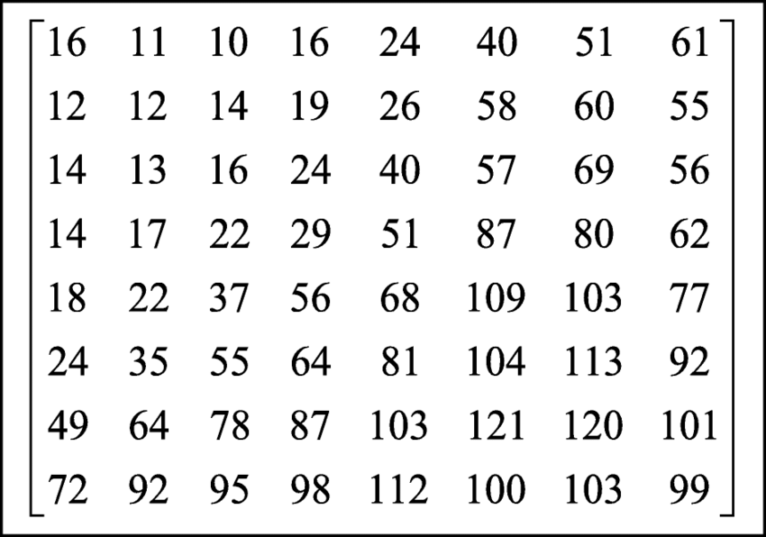

# How does JPEG work?

Kirill Borodinskiy

---

### What is JPEG?

#### JPEG =  **J**oint **P**hotographic **E**xperts **G**roup

*   A method of lossy compression for digital images.
*   Commonly used for photos and web images.
*   Compression quality can be adjusted (0-100), 
lower values lead to lower quality, higher compression.
<!-- *   **JPEG is a standard** that defines how the image should be encoded -->

---

### Steps of JPEG Algorithm

1.  Color space conversion
2.  Chroma subsampling
3.  Discrete Cosine Transform (DCT)
4.  Quantization
5.  Huffman coding
6.  Saving the file (including metadata)

---

### Color Space Conversion

*   **Y**: Luminance (brightness), represents the grayscale intensity of the image.
*   **Cb**: Blue-difference chroma, represents how much blue is in the color.
*   **Cr**: Red-difference chroma, represents how much red is in the color.

<!-- **Why YCbCr?**  
It separates the brightness (Y) from the color information (Cb and Cr). 
This allows for more efficient compression. 
Human eyes are more sensitive to changes in brightness than changes in color, so we can throw away
some color information while preserving the visual image appearance.

We need to add 128 to color elements to make sure they stay in 0-255 range
so that we can fit them into 8 bit integers.
 -->

$$
\begin{bmatrix}
Y \\
Cb \\
Cr
\end{bmatrix}
=
\begin{bmatrix}
0.299 & 0.587 & 0.114 \\
-0.168736 & -0.331264 & 0.5 \\
0.5 & -0.418688 & -0.081312
\end{bmatrix}
+
\begin{bmatrix}
0 \\
128 \\
128
\end{bmatrix}
$$

---

### Chroma Subsampling

<!-- Reduces chroma resolution to use human vision's 
lower sensitivity to color detail in our favour.
 -->

*   **4:4:4**: Full resolution for Y, Cb, and Cr.
*   **4:2:2**: Halves horizontal chroma resolution.
*   **4:2:0**: Halves both horizontal and vertical chroma resolution.

---

### Discrete Cosine Transform (DCT)

<!-- 
Breaks down an 8x8 block of pixels into a sum of different "spatial frequencies"
that represent changes in color. -->

<!-- 
*Low Frequencies* represent gradual color changes (e.g., large areas of similar color).

*High Frequencies* represent sharp details, textures, and edges. -->

<!-- 
Spatial Domain: The soup is a mix of different ingredients (vegetables, meat, broth)
all in one place. 

Frequency Domain: You break down the soup into basic flavors (salty, sweet, spicy)
that are present in different amounts. You might remove tiny bits of unwanted spices.-->

$$
F(u, v) = \frac{1}{4} C(u) C(v) \sum_{x=0}^{7} \sum_{y=0}^{7} f(x, y) \cos\left[\frac{(2x+1)u\pi}{16}\right] \cos\left[\frac{(2y+1)v\pi}{16}\right]
$$

$$
C(u) =
\begin{cases}
\frac{1}{\sqrt{2}}, & \text{if } u = 0 \\
1, & \text{if } u > 0
\end{cases}
$$

Where $f(x, y)$ is the pixel value at position $(x, y)$.

[fig 3]

---

### Quantization

Reduces precision of DCT coefficients to achieve compression. Higher quantization leads to smaller file sizes but greater loss of detail.
<!--
Think of rounding to the closest integer but with different intervals.
For small intervals, not a lot of values are lost
For large intervals more values are lost during rounding. -->

DCT table [fig 1]

Quantization table [fig 2]

<!-- 
 -->

---

### Huffman Coding

 Frequently occurring coefficient values are assigned shorter bit codes, while less frequent values receive longer codes.

Huffman tree [fig 3]

---

### Saving the File Correctly

1.  **Embedding Metadata (Header Information):**
  *   Resolution
  *   Color profile
  *   Compression quality
  *   Orientation
  *   Other image related data
2.  **Writing Compressed Data:**
  *   Combines the quantized and Huffman-coded DCT coefficients into a single, compact stream of bytes.
<!-- Which is basically everything that we had from our original image encoded into bytes

Now we are done with our file and I am done with my presentation. Thank you for listening.
 -->
---

### References

 Figure 1. By Devcore, date not disclosed <a>bit.ly/3C4OaRi</a>

 Figure 2. By Huang, Fangjun & Kim, Hyoungg, Oct 2014 <a>bit.ly/3WdnCnG</a>

 Figure 3. From Matlab docs, <a>bit.ly/4h7zUWF</a>

 Figure 4. By Meteficha, October 2007 <a>bit.ly/3Wg94nv</a>

This presentation can be found on
